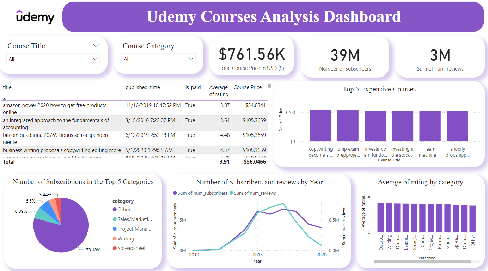

# 📊Udemy-Courses-Analysis-Project📊

  

Udemy Courses Analysis Project using Python for EDA and Data Cleaning + Power BI for Building an Interactive Dashboard.🤩

# Table of Contents
1. **Introduction**
2. **Overview Dashboard**
4. **Dataset**
5. **EDA-Financial-Consumer-Data Notebook**
6. **The Usage**

# Intoduction🤌
Welcome to our Udemy courses analysis Repository! In this Project, we delve into the vast array of courses available on Udemy to extract valuable insights and provide a comprehensive analysis. With the proliferation of online learning platforms like Udemy, understanding the trends, patterns, and characteristics of courses can offer valuable guidance for both learners and instructors.📈

To get the project presentation click [Here](https://github.com/sahermuhamed1/Udemy-Courses-Analysis-Project/blob/main/Udemy%20Financial%20Courses%20Analysis-%20Presentation.pptx)

# Overview Dashboard📈

This project addresses another businees problem In this context, I see myself as a data analyst employed at Udemy. The task involves visualizing data to help readers comprehend how countries have historically performed in The puplished courses in Udemy.

**To resolve this business problem, I followed several steps:**

1. Cleaning data in kaggle notebook.
2. Exploratory Data Analysis (EDA) using Python.
3. Data Visualizations using Plotly and matplotlip libraries
4. Utilizing the simnple imputer algoriithm to predict the missing values.
5. Importing the output data to Power BI.
6. Writing DAX formulas to extract specific measures.
7. Building our final dashboard.

# Dataset 📊
To access our dataset click [Here](https://www.kaggle.com/datasets/jilkothari/finance-accounting-courses-udemy-13k-course)

# EDA for Udemy Courses Notebook and Data Cleaning🤔

**EDA and data cleaning**
1. Drop unnecessary columns
2. Replace some missing values
3. Remove duplicates
4. Replace messing values with predictive values using Simple imputer algorithm
5. Show The Outliers of our data
6. Answer some KPIs
7. Data Visualizations
8. Wranglening our data
9. Upload the final data to Power BI

**Kaggle Notebook**

[Our Notebook is Here](finance-courses-at-udemy-eda.ipynb)

# Usage✅
Download the final dashboard from [Here](https://github.com/sahermuhamed1/Udemy-Courses-Analysis-Project/blob/main/Udemy%20Dashboard.pbix)

Download the dataset from [Here](https://www.kaggle.com/datasets/jilkothari/finance-accounting-courses-udemy-13k-course)

Download the notebook from [Here](finance-courses-at-udemy-eda.ipynb)

Download the presentation from [Here](https://github.com/sahermuhamed1/Udemy-Courses-Analysis-Project/blob/main/Udemy%20Financial%20Courses%20Analysis-%20Presentation.pptx)

# Contact info📩
For inquiries or further collaboration, please contact Saher Mohammed at [sahermuhamed176@gmail.com] and Abdelrahman Ashour at [abdoashour4040@gmail.com].🥰

[Saher's Linkdin](https://www.linkedin.com/in/sahermuhamed/)

[Abdo's Linkdin](https://www.linkedin.com/in/abdo-ashour-9467b623a/)

